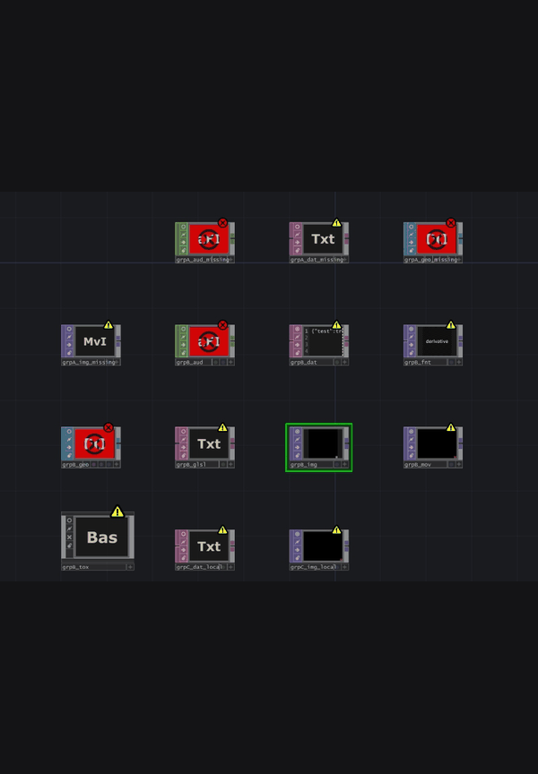
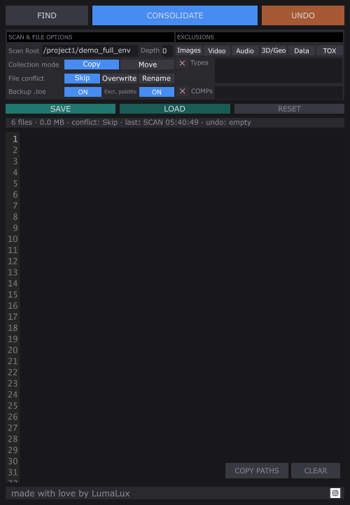
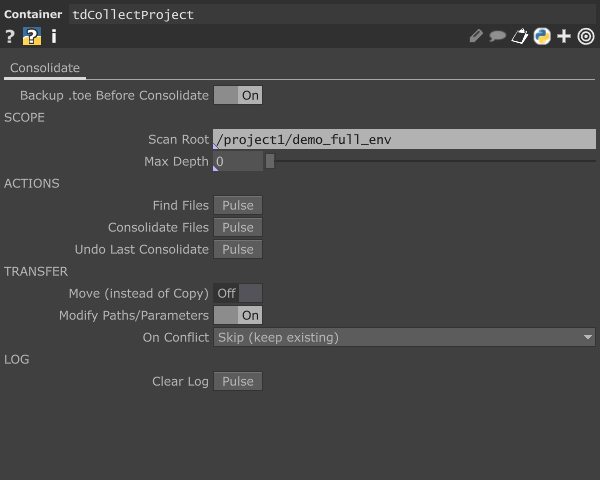
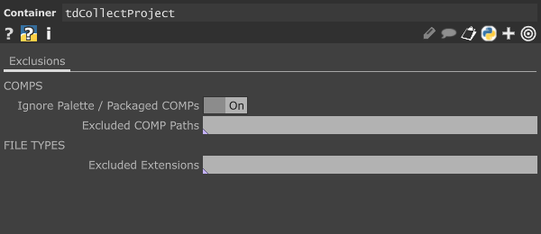
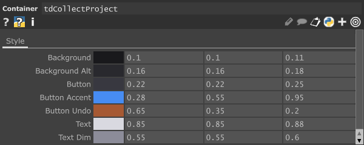
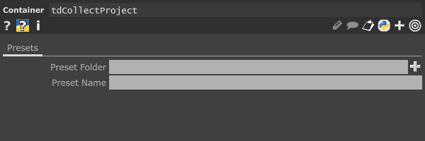
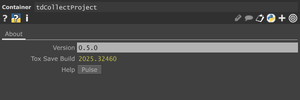

# tdCollectProject

   

> Last updated: 2026-05-16 · v0.5.1-beta — docs refresh + tooltip event-order fix

A TouchDesigner utility component that scans your project for external file dependencies, copies or moves them into a local folder structure, and rewrites operator parameters to relative paths — making your project fully portable.

> **Beta** — Core functionality is stable. Edge cases with unusual project layouts may produce unexpected results. Please [open an issue](../../issues) if you encounter problems.

---

## Screenshots





---

## The Problem

TD projects reference files by absolute path (`C:/Users/studio/assets/image.png`). Move the project to another machine or share it, and those references break. Manually hunting and relinking files is tedious and error-prone.

tdCollectProject automates the whole process.

---

## Features

- ⚠️ **Broken-path detection** — missing files flagged in the log, never silently dropped
- 📦 **Copy or Move** with three conflict strategies: Skip, Overwrite, Auto-rename
- ✏️ **Rewrites OP parameters** to relative paths after transfer
- ↩️ **Undo + replayable relocation log** — reverse in-panel, or run the generated `.py` from any terminal to roll back after TD is closed
- 📋 **Copy paths to clipboard** — one-click copy of all found absolute paths
- 🎛️ **Preset save/load** — per-project smart defaults, auto-increments on filename collision
- 🛡️ **Safety .toe backup** — saves `<project>.original.toe` once before any change
- 🧹 **Exclusion presets** — one-click toggles for Images, Video, Audio, 3D/Geo, Data, TOX

<details>
<summary>Full feature list</summary>

- Recursive scan of the entire project network or a defined subtree
- Detects file references across all operator types by evaluating string parameters
- Smart skip rule — already-local relative references that resolve inside `project.folder` are filtered out automatically; everything else (absolute, external, broken) is recorded
- Organizes collected files into standard subfolders: `Image/`, `Movie/`, `Audio/`, `Geo/`, `Data/`, `Font/`, `Component/`
- File size calculator — shows total dependency size before you commit
- Custom scan scope: root COMP and max recursion depth (0 = unlimited)
- Exclusion lists: skip specific COMPs or file extensions by name
- Palette/system exclusion — skips components from the TD palette and internal system paths
- Per-field reset buttons (`×`) next to Types and COMPs; global `RESET` for all settings
- Hover tooltips on every control — descriptions appear in the status bar
- Live status bar: conflict mode, file count, last action timestamp
- Self-contained: single `.tox`, no external Python packages or dependencies

</details>

---

## Requirements

- TouchDesigner 2025 (any build)
- Python 3.11+ (bundled with TD 2025)
- Windows (developed + tested) · macOS untested (likely works — pure-Python `os.path` + `shutil`, no platform-specific calls)

---

## Installation

1. Download `tdCollectProject.tox` from the [Releases](../../releases/latest) page.
2. In TouchDesigner, drag the `.tox` into any network.
3. The component is ready immediately — no additional setup.

**Recommended placement:** Drop it at `/project1` so it can reach the full network.

---

## Usage

### Quick Start

1. Open the component viewer (`A` on the node, or click the viewer icon)
2. Click **FIND** — scans the project and lists all found file references and total size in the log
3. Review the log output, adjust exclusions if needed, re-scan
4. Click **CONSOLIDATE** — transfers files and rewrites parameters

### Panel UI


The top row holds the three main actions; the second row holds preset save/load and the global reset. The transfer-config rows (`Collection mode`, `File conflict`, `Safety`) share a uniform left-column label width so the right-side controls line up. The `×` icons next to *Types* and *COMPs* clear that single field. **COPY PATHS** dumps every found absolute path to the clipboard, one per line. Each log row shows the filename (middle-truncated past 30 chars), node family tag in brackets, owning OP short name (truncated past 20 chars), and full path.

#### Exclusion Presets

Click any preset to instantly add or remove that file group from the exclusion list:

| Preset | Extensions |
|--------|-----------|
| Images | jpg jpeg png gif bmp tif tiff exr hdr tga psd dds svg |
| Video | mp4 mov avi mkv wmv flv webm m4v mpg mpeg mxf |
| Audio | mp3 wav aiff aif ogg flac aac m4a wma |
| 3D/Geo | fbx obj abc usd usda usdc glb gltf ply stl dae 3ds |
| Data | json xml csv txt yaml toml py glsl frag vert |
| TOX | tox |

Presets are additive — toggling one preset does not affect extensions added manually or by other presets.

---

## Parameters

### Consolidate Page

| Parameter | Type | Default | Description |
|-----------|------|---------|-------------|
| Scan Root | String | *(blank)* | COMP path to start scan from. Blank = project root. |
| Max Depth | Integer | 0 | Max recursion depth. `0` = unlimited. |
| Find Files | Pulse | — | Run the file scanner. Reports file count and total size. |
| Consolidate Files | Pulse | — | Run consolidation. |
| Undo | Pulse | — | Undo the last consolidation. |
| Move Files | Toggle | Off | Move files instead of copying. |
| Modify Params | Toggle | On | Rewrite originating OP parameters to relative paths after transfer. |
| Conflict Strategy | Menu | Skip | What to do when a file already exists at the destination. Options: Skip, Overwrite, Rename. |
| Backup Before Consolidate | Toggle | Off | When ON, CONSOLIDATE saves a one-time `<project>.original.toe` next to the running `.toe` before any change. |
| Clear Log | Pulse | — | Clear the log viewer. |



### Exclusions Page

| Parameter | Type | Default | Description |
|-----------|------|---------|-------------|
| Ignore Palette COMPs | Toggle | On | Skip components sourced from the TD palette or internal library. |
| Exclude COMPs | String | *(blank)* | Comma-separated COMP paths to exclude (e.g., `/project1/bg_assets, /project1/refs`). |
| Exclude File Types | String | *(blank)* | Comma-separated extensions to skip (e.g., `tox, py, glsl`). |



### Style Page

Per-instance color overrides for the panel UI. All values are 0.0–1.0 floats, exposed as RGB triplets so the entire skin can be re-themed without editing the TOX.

| Parameter group | Default RGB | Purpose |
|-----------------|-------------|---------|
| Background | 0.10, 0.10, 0.11 | Main panel background |
| Background Alt | 0.16, 0.16, 0.18 | Alternating row / sub-panel background |
| Button | 0.22, 0.22, 0.25 | Neutral button base color |
| Button Accent | 0.28, 0.55, 0.95 | Primary action button (CONSOLIDATE) |
| Button Undo | 0.65, 0.35, 0.20 | UNDO button accent |
| Text | 0.85, 0.85, 0.88 | Primary text / labels |
| Text Dim | 0.55, 0.55, 0.60 | Secondary text / placeholders |



### Presets Page

| Parameter | Type | Default | Description |
|-----------|------|---------|-------------|
| Preset Folder | Folder | *(blank — falls back to `~/Documents/Derivative/tdCollectProject`)* | Directory where preset JSON files live. Created automatically if the default is used and does not yet exist. |
| Preset Name | String | *(blank — falls back to `preset_<project_stem>`)* | Name of the preset to save/load (no `.json` extension needed). The default tracks the running project so each `.toe` keeps its own preset by default. |



The panel's `SAVE` and `LOAD` buttons read these two pars and write/read `<Preset Folder>/<Preset Name>.json`. The JSON contains all operational pars except `Scan Root`, `Preset Folder`, and `Preset Name`. Unknown params in a loaded JSON are skipped with a log warning (forward compatible).

**Auto-increment:** if `<Preset Name>.json` already exists at the target folder, SAVE writes `<Preset Name>_1.json`, then `_2`, etc., so previous presets are never overwritten. The log line records the new filename and notes the collision.

### About Page

| Parameter | Type | Default | Description |
|-----------|------|---------|-------------|
| Version | String | `0.5.0` | Component version. Read-only marker used by the changelog. |
| Tox Save Build | String | *(populated on save)* | TouchDesigner build number that last saved the `.tox`. Helps diagnose forward/backward compatibility issues. |
| Help | Pulse | — | Opens the README / project documentation. |



---

## Internal DATs

These DATs are accessible inside the component if you need to read results programmatically:

| DAT | Contents |
|-----|----------|
| `Files_Table` | All found file references: directory, filename, extension, OP path, file size, parameter name, **`Exists`** column (`'1'` if the source file is on disk, `'0'` if broken/missing). **Full paths are here** — open the DAT viewer (`A` on the node) to read and copy-paste any path. |
| `Log` | Full log output from last run |
| `Status_Data` | Summary row: file count, total MB, last action, timestamp, undo state |
| `Undo_Log` | Reversible actions for the in-component single-step UNDO |

## Replayable Relocation Log

Every successful CONSOLIDATE writes a self-contained Python file alongside your `.toe`:

```
<project>.relocation_<YYYYMMDD_HHMMSS>.py
```

The file contains a `restore()` function and an `ENTRIES` list with `(src, dst, mode, op_path, par_name)` for every transferred file. Run it from any terminal to roll back the transfer:

```bash
python <project>.relocation_20260505_143012.py
```

- **Move** entries are moved back from `dst` to `src`.
- **Copy / Rename** entries delete the destination (the original source is untouched).
- **Overwrite** entries are flagged unrecoverable (the original was replaced in-place; only the on-disk `.toe` backup can recover them — see *Safety .toe backup*).

This is intentionally external to TouchDesigner — the file works even after the project is moved, deleted, or TD is uninstalled. Especially useful when other projects or applications reference the same source files and need to find them at their original locations again.

---

## Output Folder Structure

After consolidation, files are placed next to your `.toe` file:

```
MyProject/
├── MyProject.toe
├── Image/
├── Movie/
├── Audio/
├── Geo/
├── Data/
├── Font/
└── Component/
```

---

## Undo

Undo reverses **the last consolidation only**:

- **Copy mode**: Restores original parameter values. Files at destination remain (they were copies).
- **Move mode**: Restores original parameter values and moves files back to their original locations.

Undo state is cleared when a new **FIND** scan is run.

---

## Known Limitations

- **Sequence file patterns** (e.g., `frame####.exr`) are not yet detected — only single file path references are picked up.
- File references built dynamically via Python expressions that don't resolve to a plain string at scan time will be missed.
- **Multi-step undo is not supported.** Undo covers the immediately preceding consolidation only.
- Parameters referencing files via `tdu.expandPath()` or similar TD path helpers may not evaluate correctly during scan.

---

## Contributing

Bug reports and pull requests welcome. See [CONTRIBUTING.md](CONTRIBUTING.md) for dev setup, code conventions, and reporting guidelines.

---

## Acknowledgments

Built on top of [TD-File-Collector](https://github.com/mourendxu/TD-File-Collector) by [mourendxu](https://github.com/mourendxu), licensed under GPL-3.0. The core file-scanning and parameter-rewriting approach originates from that project.

---

## License

GPL-3.0 — see [LICENSE](LICENSE).
